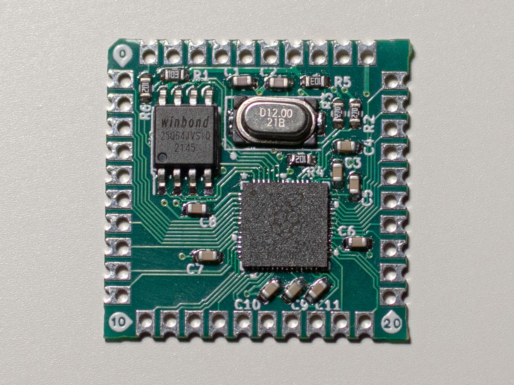

# The RP2040 Stamp (simpler, cheaper, 2 layers)

Same as the [original](https://github.com/solderparty/rp2040_stamp_hw) except it doesn't have a lot of unnecessary stuff:
* NO 500mA 3.3V LDO
* NO Neopixel
* NO LiPo supply and charging circuit
* NO Reset Button
But only uses 2 layers. So it will probably be cheaper to make. And if you use RP2040 in your design you probably have your own 3.3v regulator, LEDs, buttons and charge management IC anyway so having them here makes no sense.

The footprint is the same as in the original except 5V and VBAT are unused.
It uses unnecessarly huge flash and crystal because a couple of years ago when I wanted to try RP2040 I read in their documentation that these are the recommended models and I purchased a whole bunch of them and had them laying around. Any alternatives you might want to use will surely be smaller so it would be trivial to change the footprints on the board without rerouting anything.